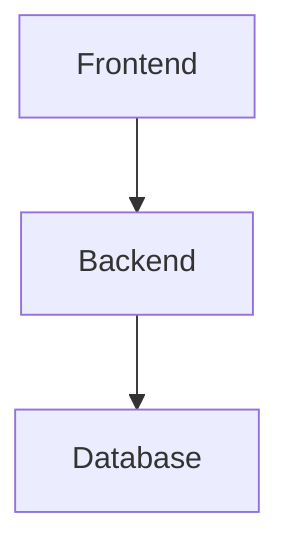
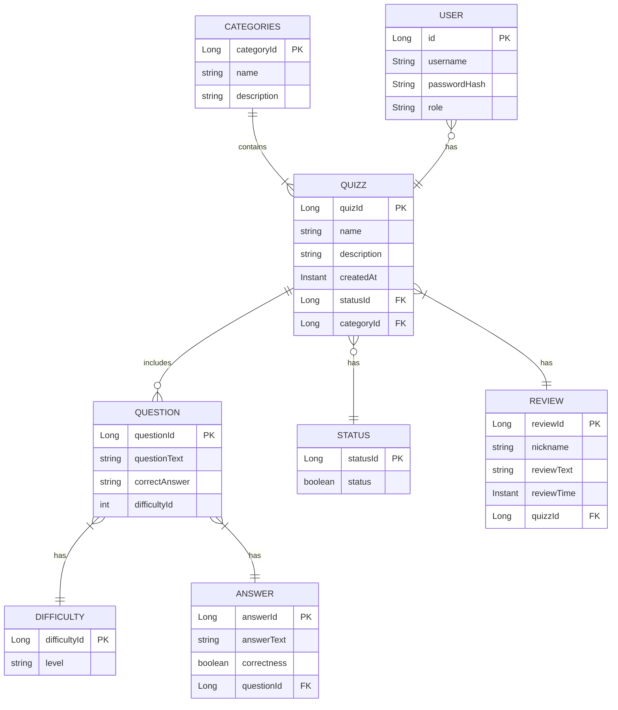

# Quizzer

A web-base application designed for teachers to create various kinds of topic-base quizzes. With the aim is for their
students to learn about course related topics. Features include 2 dashboard: One for the teachers to manage quizzes,
Another for students to take different quizzes.

***Backend using Springboot Java framework*** 
***Frontend using React***

## Team Members:

- Anh Nguyen, Github link:<https://github.com/anhng1106>
- Blazej Goszczynski, Github link:<https://github.com/Blazej3>
- Hong Phan, Github link:<https://github.com/Janphan>
- Thien Nguyen, Github link:<https://github.com/makotosoul>

## Architecture

1. Components' purpose:

- Backend: The backend is responsible for handling business logic, processing user requests, and interacting with the
  database. It serves as the middle layer that connects the frontend with the database.
  This component is implemented using Java and Spring Boot framework, providing RESTful APIs to the frontend.
- Database: The database stores all the application data, such as user information, quiz questions, and results. The
  backend communicates with the database to fetch, insert, update, or delete records as needed.
  In the development environment, H2 is used, while PostgreSQL is used in the production environment.
- Frontend: The frontend is the user interface of the app. It communicates with the backend through RESTful API requests
  to fetch and submit data.
  This component is built with JavaScript and the React framework, offering a dynamic and responsive user experience.

- Backend: Java, Spring Boot
- Database (Development): H2
- Database (Production): PostgreSQL
- Frontend: JavaScript, React

## Documentation

1. [Project Backlog](https://github.com/orgs/softProTeam1/projects/1)
2. [Swagger documentation to display the information of REST API classes](https://quizzer-project-teamb-wbwh.onrender.com/swagger-ui/index.html)

## Developer guide

### Backend

- Required Java version: Java version 17 or higher
- Start the application by running the ./mvnw spring-boot:run command on the command-line in the repository folder
- Once the application has started, visit http://localhost:8080 in a web browser to use the application
- If you have trouble starting the application with the ./mvnw spring-boot:run command
- URL: https://quizzer-project-teamb-wbwh.onrender.com/quizzlist

### Frontend

- URL: https://quizzer-project-teamb-1-alm3.onrender.com

## Generate a JAR file for the application and run the application using the JAR file

- Use the command: ./mvnw package
- Run: java -jar target/quizzer-0.0.1-SNAPSHOT.jar
- Open the application in:  http://localhost:8080

* When you change the application’s code, you need to re-generate the JAR file with the ./mvnw package command to have a
  JAR file for the latest version of the application.

## Render Instruction

- Sign in to Render using Github account
- Create a PostgreSQL database instance in Render dashboard
- Copy the values for “Username”, “Password” and “Internal Database URL” in Connections section

## Data Model

- The application's data model is designed to structure the information related to quizzes and their associated data.
- Below is an entity relationship diagram (ERD) that outlines the data model's entities, attributes, and relationships
  using Mermaid syntax.

## Frontend Deployment Instructions

1. Environment Setup:

- In the frontend folder of your project, add a .env file for the development environment.
- Define the VITE_BACKEND_URL environment variable with the URL of the backend's development environment. For example:'
  VITE_BACKEND_URL=http://localhost:8080'
- Make sure that every fetch function call in your code uses this environment variable as the URL prefix.

2. Prepare for Production:

- Create a .env.production file in the frontend folder.
- Define the VITE_BACKEND_URL environment variable with the URL of the backend's production environment. For example:'
  VITE_BACKEND_URL=https://quizzer-project-teamb-wbwh.onrender.com'
- Replace https://quizzer-project-teamb-wbwh.onrender.com with the actual URL of your backend's production environment.

3. Push Changes to GitHub:

- Commit and push these changes to your GitHub repository.

4. Setup Render:

- Sign in to Render using your GitHub account.
- Create a PostgreSQL database instance in the Render dashboard if you haven't already.
- Copy the values for “Username”, “Password”, and “Internal Database URL” in the Connections section for later use.

5. Deployment on Render:

- On the Render dashboard, click the “New” button and choose “Static Site”.
- Select your project’s repository from the repository list and click the “Connect” button.
- Choose a name for the service. If the frontend application is not initialized in the repository’s root folder, set
  “Root Directory” as the folder’s name.
- Set “Build Command” as npm run build and “Publish Directory” as dist.
- Click the “Advanced” button and set “Auto-Deploy” as “Yes” and “Branch” as “production”.
- Click the “Create Static Site” button to create the service.

6. Routing Configuration:

- On the service’s page, navigate to “Redirects/Rewrites” from the left-hand side navigation menu.
- Set the “Source” as /*, “Destination” as /index.html, and “Action” as “Rewrite”.
  -Click the “Save Changes” button.

Following these steps will deploy the frontend of Quizzer on Render, allowing users to access the application through
the specified URL.

## License

React is [MIT Licensed](./LICENSE.txt)
